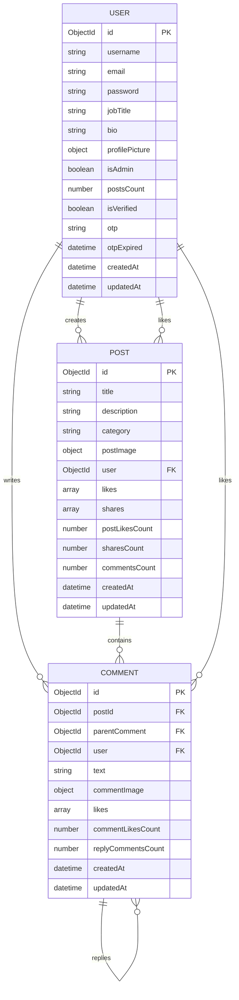

# Fluxion API

A robust, enterprise-grade RESTful API built for the **Fluxion** social media and engineering platform. Built with **Node.js**, **Express.js**, and **MongoDB (Mongoose)**, fully typed in **TypeScript**.

Includes JSON Web Token (JWT) authentication, role-based authorization, rate limiting, Zod schema validation, Cloudinary media processing, Nodemailer OTP delivery, nested comment/reply architecture, and Swagger documentation (`/api-docs`).

---

## 🛠️ Tech Stack & Dependencies

- **Runtime:** Node.js (v18+)
- **Framework:** Express.js (v5)
- **Language:** TypeScript (ESM)
- **Database:** MongoDB via Mongoose ODM
- **Validation:** Zod
- **Security:** Bcrypt.js, Helmet, CORS, Express-Rate-Limit (`authLimiter`, `apiLimiter`)
- **Media Uploads:** Multer with Cloudinary API
- **Mail Delivery:** Nodemailer (Registration OTP and Password Reset)

---

## ✨ Core API Capabilities

### 🔐 1. Authentication & Security

- **OTP Registration & Email Verification**: Users register and receive a 6-digit OTP via email (`/auth/register`), verified against DB expiration (`/auth/verify-otp`).
- **Rate-Limited Endpoints**: Login (`authLimiter`: 5 req/min) and API endpoints (`apiLimiter`: 100 req/15min).
- **Password Reset Pipeline**: Forgot password (`/auth/forgot-password`) sends signed reset links via Nodemailer.
- **Middlewares**: `verifyToken`, `verifyAuthorizedToken`, `verifyAdminToken`.

### 📝 2. Posts & Atomic Image Management

- **Single Atomic Multipart Requests**: Post creation (`POST /posts`) and updates (`PUT /posts/:postId`) handle text and `postImage` in a single `Multipart/FormData` request.
- **Deep User Populates**: Populates `user`, `likes`, `shares` with selected fields (`_id`, `username`, `profilePicture`, `jobTitle`, `bio`).
- **Social Features**: Like/unlike toggle, post sharing with `sharesCount` tracking.

### 💬 3. Comments & Nested Inline Replies

- **Comments (`/posts/:postId/comments`)**: Create, update, delete, and like comments with optional `commentImage` attachments.
- **Inline Replies (`/posts/:postId/comments/:commentId/replies`)**: Full CRUD and like pipeline for replies supporting `replyImage` attachments.

### 👤 4. User Profiles

- **Profile Details**: Supports `username` (up to 50 chars), `jobTitle` (up to 50 chars), `bio` (up to 250 chars), and profile picture uploads.
- **Cloudinary Cleanup**: Legacy Cloudinary images are automatically deleted when updated or removed.

---

## 📊 Database Entity-Relationship (ER) Diagram



---

## 🚦 Environment Setup

Create a `.env` file in the `backend/` directory:

```env
PORT=5000
MONGO_URI=mongodb://localhost:27017/fluxion
JWT_SECRET_KEY=your_secret_key
FRONTEND_URL=http://localhost:3000

# Cloudinary
CLOUDINARY_CLOUD_NAME=your_cloud_name
CLOUDINARY_API_KEY=your_api_key
CLOUDINARY_API_SECRET=your_api_secret

# Nodemailer
APP_EMAIL_ADDRESS=your_email@gmail.com
APP_EMAIL_PASSWORD=your_app_password
```

### Running Commands

```bash
# Install dependencies
npm install

# Start development server with live reload
npm run dev

# Build TypeScript to dist
npm run build
```

---

## 📖 API Documentation

Interactive Swagger API docs available at:
`http://localhost:5000/api-docs`

Full Markdown documentation available in [`API-Docs.md`](file:///c:/Programming/Backend/Projects/Express.js/Codexa/backend/API-Docs.md).
